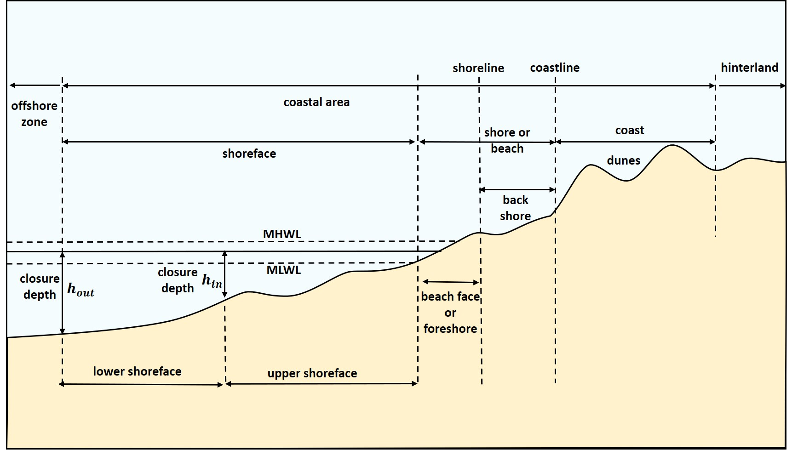

Salida de campo por la provincia de San
Cristóbal <small> Biogeografía (GEO-131) y Geomorfología
(GEO114) Universidad Autónoma de Santo Domingo (UASD) Semestre
2024-02</small>
================
El Tali
2024-12-01

<!-- README.md se genera a partir de README.Rmd. Por favor, edita ese archivo. -->

Versión HTML (quizá más legible),
[aquí](https://biogeografia-202402.github.io/salida-de-campo/README.html)

# Lista de control

- Formularios ODK.
- 1 drone, quién sabe si 2.
- 1 antena magnéticas.
- 1 cinta métrica de 3/5 m.
- 1 cinta métrica de 50 m.
- 1 receptor de la base.
- 3 receptores de los rovers.
- 3 palos (perdón, “jalones”) superiores con cable TNC-SMA y soporte de
  receptor.
- 2 antenas L1+L2+L5
- 1 antena L1+L2 (TOPGNSS)
- 1 detector de particulado

# Itinerario

## Playa Palenque

- Link de GoogleMaps: <https://maps.app.goo.gl/fLEAzApsdPEPAFF9A>

- Link del MTN 50K:
  <https://geofis.xyz/lm/index.php/view/map/?repository=mtnrd50k&project=mtnrd50k&layers=BTTT&bbox=-7815318.746272%2C2063263.094145%2C-7808124.110985%2C2066592.882189&crs=EPSG%3A3857&layerStyles=Topo_Map%3Apredeterminado>

- Actividades y temas:

  - Intento de generación de perfil de playa
  - Vuelo fotogramétrico
  - La fuerte vinculación entre ecosistemas litorales y la geomorfología
    de procesos litorales
  - Erosión costera, agradación, granulometría (percentiles, deciles)
  - Análisis de cambio en la línea de costa usando imágenes satelitales
  - Procesos litorales, entre ellos la formación de acantilados, beach
    rock (y grés de playa), perfil de playa, asociación con el manglar
  - Delimitación y estructura del medio litoral, la nomenclatura inglesa
    y castellana
  - FORMÚLATE PREGUNTAS DE INVESTIGACIÓN

- Recursos:

  - Definiciones:
    <https://coastalwiki.org/wiki/Definitions_of_coastal_terms>

 

 Tomado de:
<https://www.coastalwiki.org/wiki/Definitions_of_coastal_terms>

 

 

 

## Río Nizao en Balneario entre Juan Barón y Don Gregorio.

- Link de GoogleMaps: <https://maps.app.goo.gl/bWBSQ74nrTQpCC38A>. Un
  link de GoogleMaps retirado del balneario, con más extracciones de
  áridos en las proximidades de Don Gregorio:
  <https://maps.app.goo.gl/EcgkJSVYT6s5QVhu9>. Alternativamente, en
  Lucas Díaz. Localización: <https://maps.app.goo.gl/v7RSieUVMVoKXonU8>.

- Link del MTN 50K:
  <https://geofis.xyz/lm/index.php/view/map/?repository=mtnrd50k&project=mtnrd50k&layers=BTTT&bbox=-7817795.146882%2C2065418.372167%2C-7810600.511596%2C2068748.160211&crs=EPSG%3A3857&layerStyles=Topo_Map%3Apredeterminado>

- Actividades y temas:

  - Intento de medición del caudal (nadie se va a querer mojar los pies
    tali)
  - Uso público del espacio
  - Extracción de agregados
  - Procesos fluviales, hidráulica de canal
  - Vegetación de barras fluviales (lagunas temporales por extracción)
  - Fauna acuática
  - Dónde estudiar biogeografía insular en un río
  - Elementos y estructura del valle y la llanura aluvial
  - Identificación de rocas y minerales
  - FORMÚLATE PREGUNTAS DE INVESTIGACIÓN

- Recursos:

  - Demo de medición de caudal:
    <https://www.youtube.com/watch?v=4uS9oOTa4PI>.

 

 

 

 

 

 

## Grancera, arenera, empresa de áridos (quizá “Arenera Valdez”)

- Link de GoogleMaps: <https://maps.app.goo.gl/SZRtJDpaHLT17EG57>

- Link del MTN 50K:
  <https://geofis.xyz/lm/index.php/view/map/?repository=mtnrd50k&project=mtnrd50k&layers=BTTT&bbox=-7820725.658911%2C2065852.154826%2C-7813531.023625%2C2069181.942871&crs=EPSG%3A3857&layerStyles=Topo_Map%3Apredeterminado>

- Actividades y temas:

  - Explotación de agregados (grancera, empresa de áridos)
  - Formación de terrazas y lechos de ríos en climas húmedos, con
    indicación de riesgos asociados.
  - Identificación de rocas y minerales
  - Terrazas fluviales, paleocanales, caracterización del material
    grueso
  - Impacto sobre el ecosistema. Oportunidades para la fauna y la flora
  - Contaminación ambiental
  - Particulado
  - FORMÚLATE PREGUNTAS DE INVESTIGACIÓN

## El Tablazo, Cambita, orilla del río Nigua

- Link de GoogleMaps: <https://maps.app.goo.gl/GqKwKZ2pfCcZuP4t7>

- Link del MTN 50k:
  <https://geofis.xyz/lm/index.php/view/map/?repository=mtnrd50k&project=mtnrd50k&layers=BTTT&bbox=-7815072.440247%2C2092550.958973%2C-7807877.804961%2C2095880.747017&crs=EPSG%3A3857&layerStyles=Topo_Map%3Apredeterminado>

- Actividades y temas:

  - Bosque húmedo/ombrófilo/tropical lluvioso
  - Demostración de cómo muestrear flora y vegetación
  - Si no se logró antes, intento de medición del caudal (nadie se va a
    querer mojar los pies tali)
  - Procesos fluviales
  - Identificación de rocas y minerales
  - Modelo evolutivos del relieve
  - Morfosistema kárstico, desarrollo del endokarst, acuíferos libres,
    espeleodesarrollo, macroformas del karst
  - Intemperización: formaciones superficiales, especialmente en el
    karst y en vertiente alterada
  - Procesos de vertientes, entre ellos movimientos en masa
    (e.g. deslizamientos)
  - FORMÚLATE PREGUNTAS DE INVESTIGACIÓN

## Boca de Nigua (La Playita).

- Link de GoogleMaps: <https://maps.app.goo.gl/ei8ereANDS7AgZbo6>

- Link del MTN 50k:
  <https://geofis.xyz/lm/index.php/view/map/?repository=mtnrd50k&project=mtnrd50k&layers=BTTT&bbox=-7802138.77892%2C2079505.571155%2C-7794944.143634%2C2082835.3592&crs=EPSG%3A3857&layerStyles=Topo_Map%3Apredeterminado>

- Actividades y temas:

  - Procesos litorales, entre ellos la formación de acantilados, beach
    rock (y grés de playa), perfil de playa, asociación con el manglar
  - La fuerte vinculación entre ecosistemas litorales y la geomorfología
    de procesos litorales
  - Erosión costera, agradación, granulometría (percentiles, deciles)
  - Delimitación y estructura del medio litoral, la nomenclatura inglesa
    y castellana
  - FORMÚLATE PREGUNTAS DE INVESTIGACIÓN

## La Represa, ríos Isa y Mana (NO VA A DAR EL TIEMPO TALI, ACÉPTALO)

- Link de GoogleMaps: <https://maps.app.goo.gl/ABhxQTcrK34877cD6>

- Link del MTN 50k:
  <https://geofis.xyz/lm/index.php/view/map/?repository=mtnrd50k&project=mtnrd50k&layers=BTTT&bbox=-7822576.014749%2C2104407.975234%2C-7808186.744176%2C2111067.551322&crs=EPSG%3A3857&layerStyles=Topo_Map%3Apredeterminado>

- Actividades y temas:

  - Bosque húmedo/ombrófilo/tropical lluvioso
  - El río de tramos rectilíneos
  - Demostración de cómo muestrear flora y vegetación
  - Si no se logró antes, intento de medición del caudal (nadie se va a
    querer mojar los pies tali)
  - Procesos fluviales
  - Identificación de rocas y minerales
  - Intemperización: formaciones superficiales, especialmente en el
    karst y en vertiente alterada
  - Procesos de vertientes, entre ellos movimientos en masa
    (e.g. deslizamientos)
  - FORMÚLATE PREGUNTAS DE INVESTIGACIÓN

# Logística básica de la salida de campo

## Fecha, hora, lugar

- Fecha: domingo 1 de diciembre, 2024

- Hora: debes llegar, como muy tarde, a las 6.45 am.

- Lugar de salida: Aula Magna, Sede Central.

- Lugar de destino: provincia San Cristóbal.

## ¿Qué llevar?

### Generales

- Cuaderno, siempre que quieras tomar nota de forma analógica, al estilo
  tradicional. Eso sí, te recomiendo que uses lápiz en lugar de
  bolígrafo.

- **¡Mucha (pero mucha) agua potable!**

- **Protección contra el sol (protector solar en crema, camisa manga
  larga, sombrero, ¡TODO es útil!). ¡HARÁ MUCHO SOL!**

- **Comida** (llevarla puesta, es decir, lista para abrir y comer en
  cualquier lugar y momento).

- Repelente. No suele haber mosquitos, pero no está de más llevarlo por
  si acaso.

- Por supuesto no hay “código de vestimenta”, sólo considera lo
  siguiente. Usa pantalón largo de tela fuerte y fresca para evitar
  “puyones”. El pantalón corto se desaconseja, pues te expondrá a
  espinas y picaduras de insectos.

- **Celular**

- Calzado apropiado.

- ¿Te dije ya que llevaras mucha agua y forma de protegerte del sol?
  Pues por si lo olvidé, lleva mucha agua y protégete del sol.

### Recomendados

- Funda impermeable para celular.

- Chaleco reflector.

# Seguridad, riesgos, situaciones de emergencia

Los riesgos asociados al viaje de campo son los mismos que en cualquier
otro. Considera las siguientes medidas de seguridad:

- Notifica al menos un contacto de emergencia a tus compañeros y
  compañeras.

- Si sufres de alguna condición de salud que consideres importante
  notificar, indicáselo al profesor.

- Toma precauciones adicionales al pasar la mano cerca del suelo o al
  caminar entre el matorral; es por esto que no se recomienda pantalón
  corto. No agarres de tallos o troncos sin antes inspeccionarlos. Y
  tampoco satanices a estas dos amigas que te presento a continuación,
  pero respétalas:

|                                                                                                                                                                                        Guasábara                                                                                                                                                                                         |                                                                                                                                                                            Guao                                                                                                                                                                            |
|:----------------------------------------------------------------------------------------------------------------------------------------------------------------------------------------------------------------------------------------------------------------------------------------------------------------------------------------------------------------------------------------:|:----------------------------------------------------------------------------------------------------------------------------------------------------------------------------------------------------------------------------------------------------------------------------------------------------------------------------------------------------------:|
|                                                                                                                                                                                                                                                                                                                                                      |                                                                                                                                                                                                                                                                                                                          |
| *Cylindropuntia caribaea* (Britton & Rose) F.M.Knuth. Probabilidad de encontrarla: muy alta. <a href="https://commons.wikimedia.org/wiki/User:CactiLegacy">CactiLegacy</a>, <a href="https://commons.wikimedia.org/wiki/File:Cylindropuntia_caribaea.jpg">Cylindropuntia caribaea</a>, <a href="https://creativecommons.org/licenses/by-sa/4.0/legalcode" rel="license">CC BY-SA 4.0</a> | *Comocladia dodonaea* Britton. Probabilidad de encontrarla: media. <a href="https://commons.wikimedia.org/wiki/User:Xemenendura">Xemenendura</a>, <a href="https://commons.wikimedia.org/wiki/File:Comocladia_dodonaea_1.JPG">Comocladia dodonaea 1</a>, <a href="https://creativecommons.org/licenses/by-sa/3.0/legalcode" rel="license">CC BY-SA 3.0</a> |

# Aplicaciones y servicios útiles para geomorfología y biogeografía

Considera evaluar las siguientes aplicaciones.

- GoogleMaps.

- Formularios electrónicos: [ODK
  Collect](https://play.google.com/store/apps/details?id=org.odk.collect.android)

- Mapas en el celular (muchas herramientas disponibles):
  [OruxMaps](https://www.oruxmaps.com/cs/es)

- Guardar el trayecto: [GPS
  Logger](https://play.google.com/store/apps/details?id=eu.basicairdata.graziano.gpslogger)

- Mapas en el celular: [Mapit
  GIS](https://play.google.com/store/apps/details?id=com.osedok.gisdatacollector)

- Mapas en el celular: [SW
  Maps](https://play.google.com/store/apps/details?id=np.com.softwel.swmaps)

- Para identificación de especies, reporte, ciencia ciudadana. Créate
  una cuenta: [iNaturalist](https://www.inaturalist.org/)

- Ciencia ciudadana, monitoreo y conservaciónde bosque: [Forest
  Watcher](https://play.google.com/store/apps/details?id=com.forestwatcher)

- Ciencia ciudadana: [iTree](https://www.itreetools.org/)

- Predice la flora probable de un lugar.
  [Pl@ntNet](https://identify.plantnet.org/)

- Lista exhaustiva de plantas, nombres: [World Flora Online (WFO) Plant
  List](https://wfoplantlist.org/plant-list)

# Referencias
